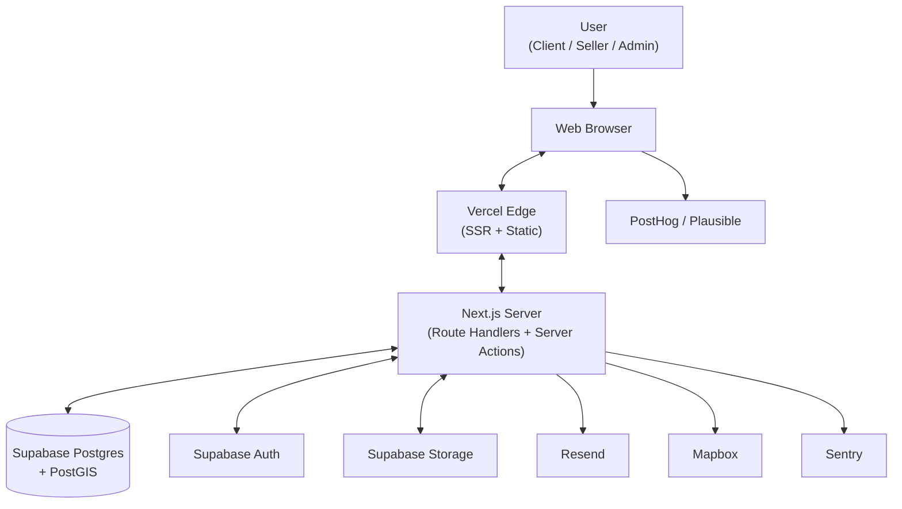
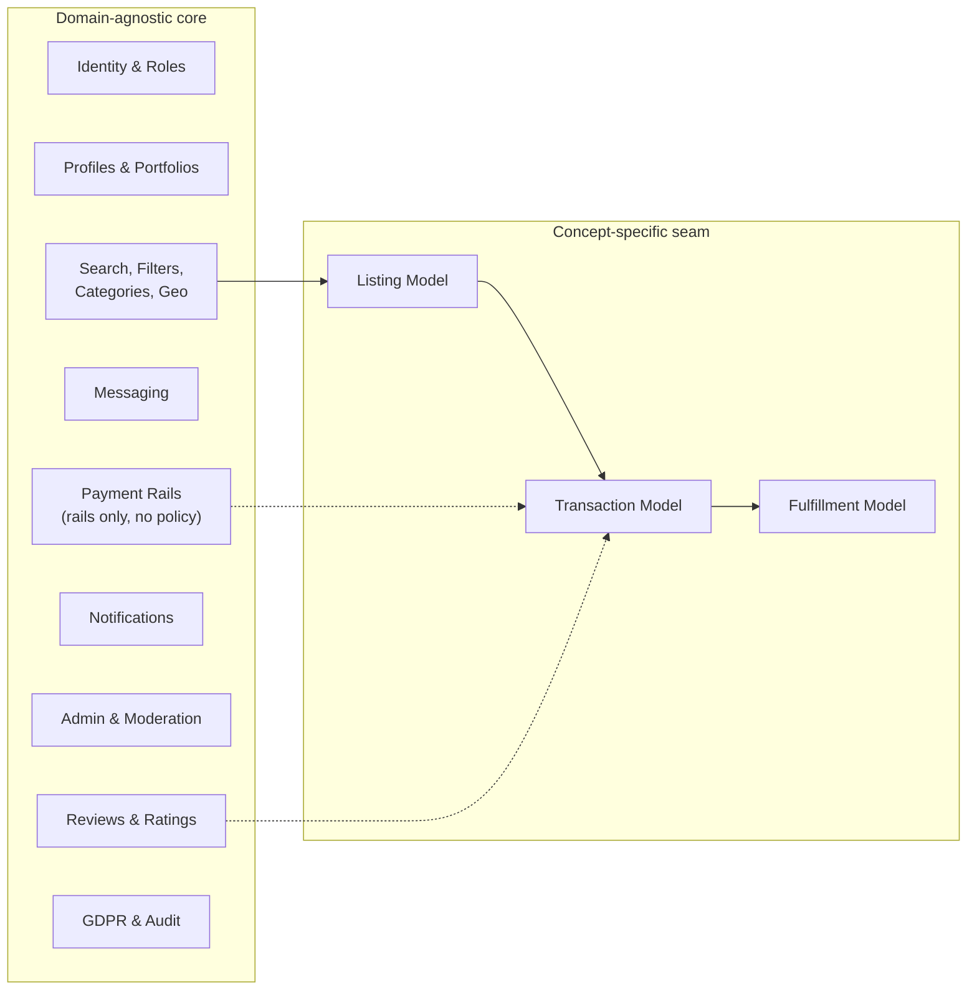
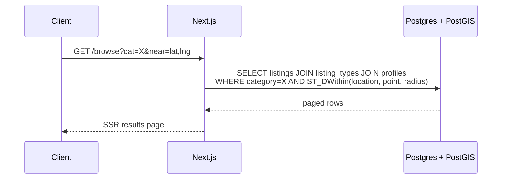

# Architecture

High-level system shape, with explicit attention to the seam between the domain-agnostic core and the concept-specific listing / transaction / fulfillment layer.

## System overview



## The seam: domain-agnostic core vs. concept-specific modules

Code that is shared across the two candidate concepts is built. Code that will differ is stubbed with explicit module boundaries.



The arrows from the seam back into the core (Review-attached-to-Transaction, Payment-attached-to-Transaction) are stable shapes. What varies between the two candidate concepts is **what** a Listing, Transaction, and Fulfillment look like internally.

### Concrete implication

A `listing_types` table declares each supported Listing type and its fulfillment model:

| id | name | fulfillment_model |
|----|------|-------------------|
| `service` | Service offering | `booking_required` |
| `product` | Physical good | `shippable_product` |
| `digital` | Digital download | `digital` |

A Listing row references a `listing_type_id`. Concept-specific attributes live in a JSONB `attributes` column, validated at the application layer with a Zod schema chosen per type. This keeps the data model open while pushing concept-specific complexity into typed adapters.

## Folder structure (target)

To be created in the next round; documenting intent here so the next batch is unambiguous.

```
src/
  app/                       # Next.js App Router (routes + server actions)
    [locale]/                # i18n routing
      (marketing)/           # Public landing + content pages
      (auth)/                # Sign-in, sign-up, password reset
      (app)/                 # Authenticated app
      api/                   # Route handlers
  core/                      # Domain-agnostic business logic
    identity/
    profiles/
    discovery/
    messaging/
    reviews/
    notifications/
    admin/
    payments/                # Rails only; no concept policy
    compliance/
  concepts/                  # The seam
    _shared/                 # Shared interfaces (Listing, Transaction, Fulfillment)
    services/                # If concept (a) wins, lives here
    goods/                   # If concept (b) wins, lives here
  ui/                        # shadcn/ui + project components
  lib/                       # DB client, env, utilities
  i18n/                      # Locale resources
```

`concepts/services` and `concepts/goods` are placeholders in the foundation. Only the chosen concept's folder gets filled in once the partner's research lands.

## Data-flow example: Transaction creation (services concept)

```mermaid
sequenceDiagram
    participant Client
    participant Web as Next.js
    participant DB as Postgres
    participant Email as Resend

    Client->>Web: GET /listing/[id]
    Web->>DB: SELECT listing, availability
    DB-->>Web: rows
    Web-->>Client: SSR page

    Client->>Web: POST /reserve (slot)
    Web->>DB: BEGIN; check slot; INSERT transaction + booking; COMMIT
    DB-->>Web: transaction id
    Web->>Email: send confirmation to client
    Web->>Email: send notification to seller
    Web-->>Client: confirmation page
```

The same shape applies to the goods concept, with `INSERT transaction + shipment` replacing `INSERT transaction + booking`, and inventory decremented inside the same DB transaction.

## Discovery query (concept-neutral)



## Authentication and authorisation

- **Authentication:** Supabase Auth (decision pending on which methods to enable initially).
- **Authorisation:** Postgres Row-Level Security policies on all user-owned data, derived from the authenticated `auth.uid()`. This is the primary defence; application-layer checks are belt-and-braces, not the line of defence.
- **Role-based checks** in server actions for admin and moderator routes.

## Performance and scale targets (deferred)

Foundation phase is correctness- and structure-oriented, not performance-oriented. Real targets ship with the MVP phase. Listed here only so future decisions have a grounding:

- Median page TTFB < 300ms in Europe.
- Search query p95 < 200ms at < 10k listings.
- Image delivery via CDN with cached transforms.

## Compliance baseline

- GDPR by default (EU data residency, DPA agreements, consent gating).
- Right to erasure: cascading delete planned at schema design time.
- Audit log of admin actions.
- Payment data never stored locally; tokenisation only (when payments are live).

## Diagrams

- This page contains Mermaid diagrams that render in GitHub and most markdown viewers.
- An editable Excalidraw version of the system overview lives at [diagrams/architecture.excalidraw](diagrams/architecture.excalidraw) — open it at <https://excalidraw.com> via File → Open.
- The core entity-relationship diagram lives at [diagrams/erd-core.md](diagrams/erd-core.md).
