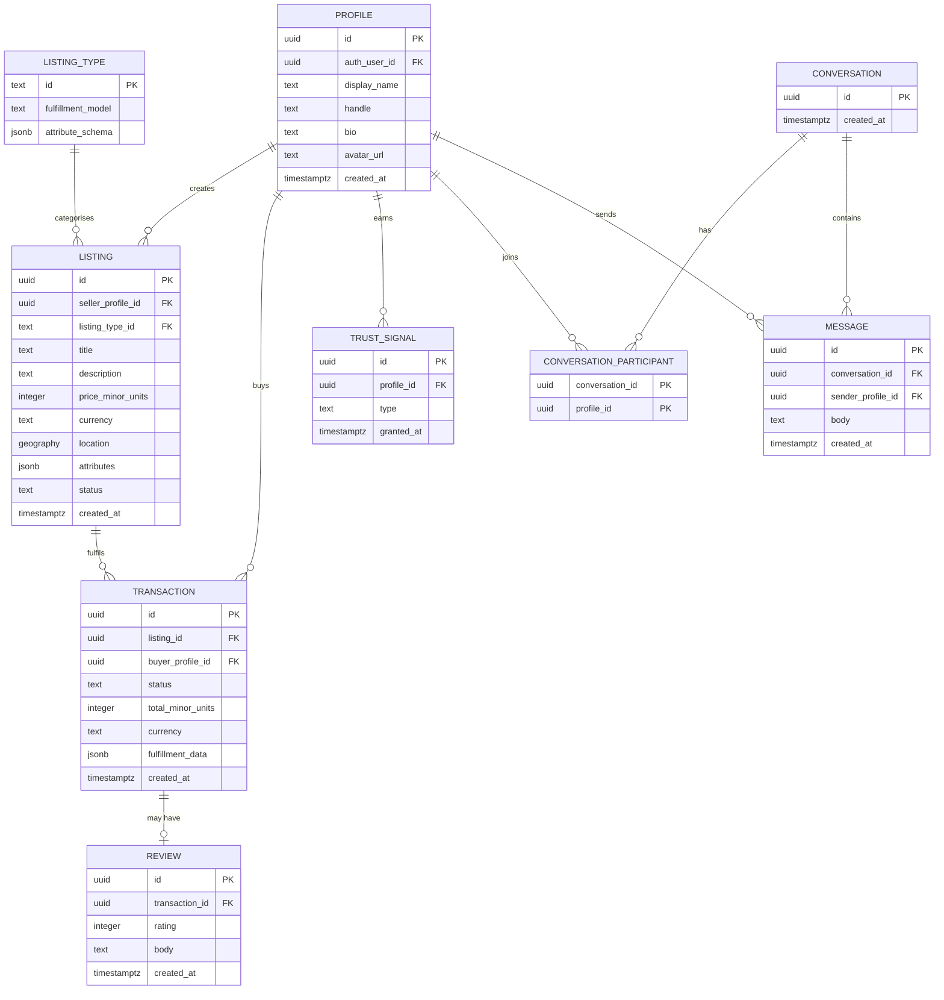

# Core entity-relationship diagram

This is the **domain-agnostic core** schema. The shape below is stable across both candidate concepts. Concept-specific fields live in a JSONB `attributes` column on `LISTING`, validated by a Zod schema per `listing_type`.

## Notes on the shape

- **`PROFILE` is the application-side user record**, separate from `auth.users` (managed by Supabase Auth). The split lets us evolve profile fields without touching auth internals.
- **`LISTING_TYPE`** is the registry of supported Listing flavours. A row exists per supported type (`service`, `product`, `digital`, etc.). Its `attribute_schema` is a JSON Schema or Zod-serialised schema that validates the `LISTING.attributes` column for that type.
- **`LISTING.attributes`** is the concept-specific bag. For a service Listing it may hold duration, price-per-hour, availability; for a goods Listing it may hold variants, inventory count, shipping weight. Validation is enforced in the application layer per type.
- **`TRANSACTION`** is the canonical buy record across both concepts. Its `fulfillment_data` JSONB carries the booking slot or shipping address depending on type. This keeps Reviews, Payments, and Audit attached to a single stable shape.
- **`REVIEW`** is keyed by transaction, not by buyer-on-seller — a Review must reference a completed Transaction. This is the anti-fake-review fence.
- **`TRUST_SIGNAL`** is one row per earned tier (`email_verified`, `phone_verified`, `payment_account_connected`, `id_verified`, `manually_reviewed`). Querying "is this Seller payment-verified?" is then a single row check.
- **`CONVERSATION` + `CONVERSATION_PARTICIPANT` + `MESSAGE`** is the standard many-participants chat schema. Most marketplaces only need 1-to-1, but the schema allows N participants for future group inquiries without a migration.

## Not in this diagram (intentionally)

- Tables for the **chosen concept's Fulfillment model** — `bookings` (services) or `shipments` (goods). These land at concept-lock and live in the `concepts/<chosen>/` module. Until then, fulfillment data is parked in `TRANSACTION.fulfillment_data` JSONB.
- **Payment-related tables.** When Stripe Connect is wired in, expect `payment_methods`, `payment_intents`, `payouts`, `disputes`. Foundation reserves space; nothing built yet.
- **Notifications**, **audit log**, **admin actions** — minor support tables that will be added with their respective subsystems.
